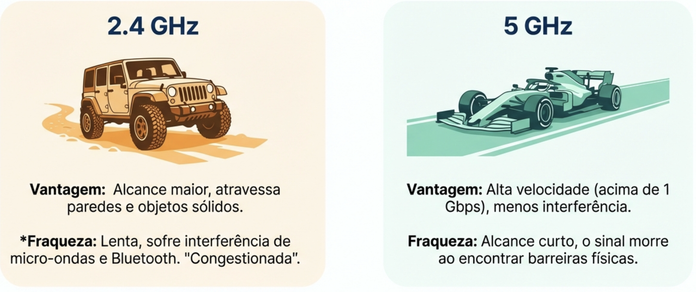

## Objetivos da aula

- Entender a arquitetura básica de uma **WLAN Wi-Fi** (AP, SSID, BSS)
- Compreender os mecanismos técnicos por trás do Wi-Fi: **OFDM, CSMA/CA e MIMO**
- Reconhecer a diferença entre **WLAN e Wi-Fi** como conceito x marca
- Preparar terreno para a evolução histórica do padrão, na próxima aula

::: {.notes}
Gancho: perguntar por que às vezes o Wi-Fi de casa "engasga" quando muita gente está conectada ao mesmo tempo — a resposta está no meio compartilhado e nos mecanismos de acesso que veremos hoje.
:::

---

## A arquitetura básica de uma WLAN

- **Ponto de Acesso (AP)** — dispositivo central que conecta os clientes sem fio à rede cabeada
- **SSID** — o "nome" da rede Wi-Fi, usado para identificá-la
- **BSS (Basic Service Set)** — conjunto de dispositivos conectados a um mesmo AP
- Padrão técnico: **IEEE 802.11**

::: {.callout-note}
**WLAN ≠ Wi-Fi**: WLAN é a categoria (rede local sem fio); Wi-Fi é a certificação/marca da família de padrões IEEE 802.11 que implementa essa categoria — praticamente toda WLAN hoje é Wi-Fi, mas o termo técnico correto para a categoria é WLAN.
:::

## Onde o Wi-Fi "vive": banda ISM

- Opera principalmente nas faixas **2,4 GHz e 5 GHz**, parte do espectro **ISM (Industrial, Scientific and Medical)** — não licenciado
- **2,4 GHz**: maior alcance, atravessa obstáculos melhor, mas **mais interferência** (compartilhada com Bluetooth, micro-ondas, etc.) e só 3 canais não sobrepostos (1, 6, 11)

{fig-alt="Analogia visual: 2,4 GHz como um jipe todo-o-terreno (alcance maior, atravessa paredes e objetos sólidos, mas sofre interferência de micro-ondas e Bluetooth) e 5 GHz como um carro de corrida (alta velocidade acima de 1 Gbps, menos interferência, mas alcance curto e dificuldade em atravessar paredes grossas)"}
- **5 GHz**: menos alcance e penetração em paredes, porém **muito menos interferência** e mais canais disponíveis
- **6 GHz (Wi-Fi 6E e 7)**: uma "autoestrada" recém-aberta, livre de dispositivos antigos, permitindo velocidades gigabit reais sem a disputa histórica das outras duas faixas

---

## OFDM — Orthogonal Frequency-Division Multiplexing

- Técnica de modulação que **divide um canal em várias subportadoras ortogonais**, transmitidas em paralelo
- Cada subportadora carrega uma parte pequena e lenta dos dados — juntas, formam uma transmissão rápida e **resistente a multipath** (reflexões do sinal)
- É a base técnica do Wi-Fi moderno (a partir do 802.11a/g) e também de WiMAX, LTE e 5G

## CSMA/CA — Carrier Sense Multiple Access with Collision Avoidance

- Mecanismo de **acesso ao meio** usado pelo Wi-Fi para decidir quem transmite e quando
- Diferente do CSMA/CD do Ethernet: em uma rede sem fio, um dispositivo **não consegue "ouvir" a própria transmissão** enquanto transmite, então detectar colisão em tempo real não é viável — por isso o foco é **evitar** a colisão, não detectá-la
- Passo básico: o dispositivo **escuta o canal**; se estiver livre, espera um tempo aleatório (*backoff*) e só então transmite

::: {.notes}
Deixar claro que essa diferença CSMA/CA x CSMA/CD é conceitual e cai facilmente em prova/atividade: "por que Wi-Fi não usa CSMA/CD como o cabo Ethernet?" — porque não dá para detectar colisão no ar do jeito que se detecta em um cabo.
:::

---

## MIMO — Multiple Input, Multiple Output

- Uso de **múltiplas antenas** de transmissão e recepção simultaneamente
- Permite enviar **vários fluxos de dados em paralelo** no mesmo canal, aumentando a taxa efetiva sem precisar de mais espectro
- **MU-MIMO (Multi-User MIMO)** — o AP atende **vários dispositivos ao mesmo tempo** em fluxos MIMO separados, em vez de um de cada vez
- **Beamforming** — o AP direciona o sinal (fase das antenas) especificamente para onde está cada cliente, melhorando alcance e velocidade

## Juntando as peças

::: {.incremental}
- **OFDM** decide *como* os bits viajam dentro do canal de rádio
- **CSMA/CA** decide *quem* pode transmitir e *quando*, evitando colisões
- **MIMO/MU-MIMO/Beamforming** decidem *quantos fluxos* e *para onde* o sinal é direcionado
- Essas três peças, combinadas, são o que torna o Wi-Fi moderno rápido e capaz de atender muitos dispositivos ao mesmo tempo
:::

---

## Discussão rápida {background-color="#eaf5ec"}

**Por que o Wi-Fi lento em festas cheias?**

::: {.fragment}
Em duplas (5 min): em um evento com 200 pessoas conectadas ao mesmo AP, o Wi-Fi fica lento mesmo com bom sinal. Qual dos 3 mecanismos (OFDM, CSMA/CA, MIMO) explica melhor esse gargalo? Justifiquem.
:::

## Atividade da aula

::: {.callout-lab}
**Em duplas (10 min):**

1. Abram as configurações de Wi-Fi de um celular (modo avião ligado, sem conectar de fato) e identifiquem quantas redes 2,4 GHz e quantas 5 GHz aparecem na lista
2. Para cada faixa observada, apontem 1 vantagem prática (alcance x velocidade/interferência)
3. Discutam: por que a maioria dos roteadores modernos oferece as duas faixas simultaneamente?
:::

---

## Síntese da aula

- WLAN é a categoria; **Wi-Fi (IEEE 802.11)** é a tecnologia dominante que a implementa
- Opera nas faixas **2,4 GHz e 5 GHz** (espectro ISM não licenciado)
- **OFDM** organiza a transmissão em subportadoras resistentes a multipath
- **CSMA/CA** evita colisões no meio compartilhado (diferente do CSMA/CD cabeado)
- **MIMO/MU-MIMO/Beamforming** multiplicam capacidade e direcionam o sinal

## Próxima aula

**Evolução do Wi-Fi** — a família 802.11 e a comparação técnica entre 802.11a, 802.11b e 802.11g

---

## Referências

- RAPPAPORT, T. S. *Comunicações Sem Fio: Princípios e Práticas*. 2ª ed. Pearson Universidades, 2008.
- ROCHOL, J. *Sistemas de Comunicação Sem Fio - Conceitos e Aplicações*. Bookman, 2018.
