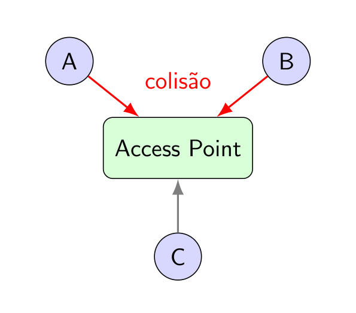
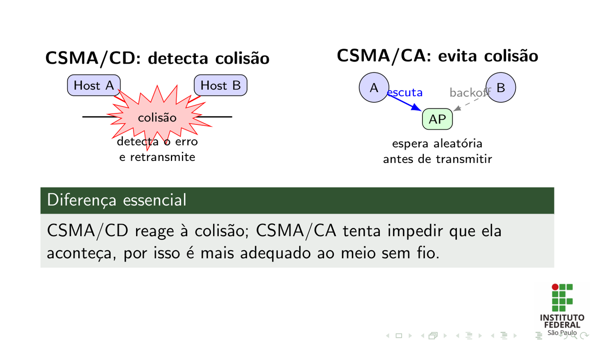
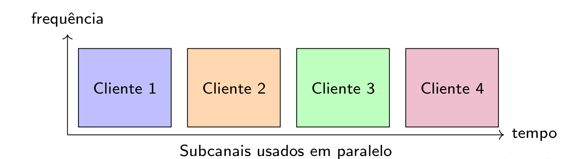
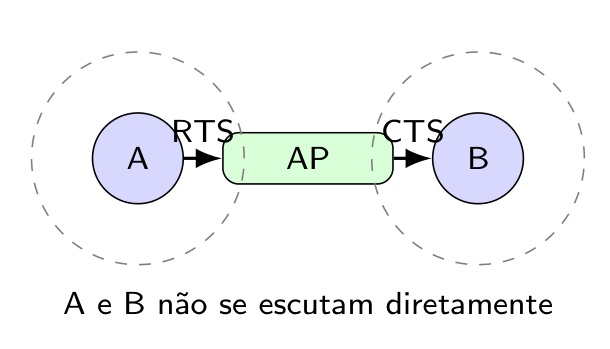
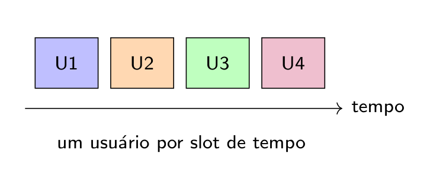
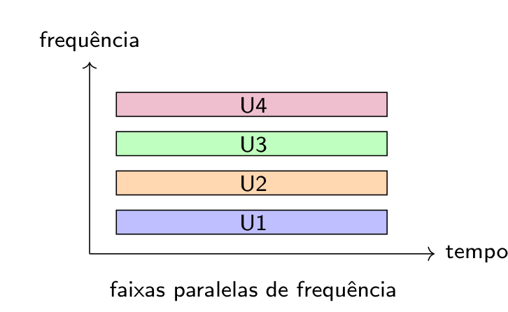
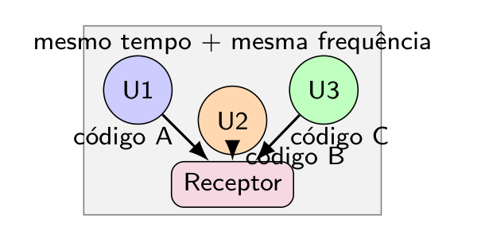

## Objetivos da aula

- Entender por que é preciso **controlar o acesso ao meio** compartilhado
- Detalhar o funcionamento passo a passo do **CSMA/CA** e o mecanismo **RTS/CTS**
- Comparar **TDMA, FDMA, CDMA e OFDMA** como estratégias de multiplexação
- Relacionar cada método com a tecnologia que o utiliza (Wi-Fi, celular)

::: {.notes}
Gancho: comparar o meio sem fio a uma sala de aula onde todos falam ao mesmo tempo — sem uma "regra" de quem fala quando, ninguém se entende. É exatamente esse o papel do controle de acesso ao meio (MAC).
:::

---

## Por que controlar o acesso ao meio?

{fig-alt="Dispositivos A e B transmitindo ao mesmo tempo para um Access Point, causando colisão; dispositivo C aguarda"}

- Em redes sem fio, o meio de transmissão é o ar
- O espectro de radiofrequência é compartilhado por vários dispositivos
- Transmissões simultâneas no mesmo canal podem causar colisões e perda de dados
- Protocolos MAC organizam quem transmite e em qual momento

## CSMA/CA x CSMA/CD

{fig-alt="À esquerda, Host A e Host B colidem no meio cabeado e o CSMA/CD detecta o erro e retransmite; à direita, A escuta o canal, aguarda um backoff aleatório antes de transmitir para o AP, evitando a colisão com B"}

- **CSMA/CD** (Ethernet cabeado): escuta o canal e, se detectar colisão, **reage** — detecta o erro e retransmite
- **CSMA/CA** (Wi-Fi): como um rádio não consegue "ouvir" e "falar" ao mesmo tempo com confiabilidade, a estratégia é **evitar** a colisão antes que ela aconteça
- Passos do CSMA/CA no Wi-Fi:
  1. **Carrier sense** — o dispositivo escuta o canal
  2. **Multiple access** — vários dispositivos disputam o mesmo meio
  3. **Collision avoidance** — se livre, espera um tempo aleatório de **backoff** antes de transmitir
  4. **Confirmação** — aguarda um ACK do receptor quando o pacote chega corretamente

::: {.callout-note}
**Diferença essencial:** CSMA/CD reage à colisão; CSMA/CA tenta impedir que ela aconteça — por isso é mais adequado ao meio sem fio, onde detectar colisão em tempo real não é confiável.
:::

---

## OFDMA — dividindo o canal em Resource Units

{fig-alt="Eixo frequência x tempo mostrando 4 blocos coloridos (Cliente 1 a 4) lado a lado, representando subcanais usados em paralelo em um único envio do AP"}

- Presente no Wi-Fi 6 (IEEE 802.11ax) e aprimorado no Wi-Fi 7, além de usado em 4G/5G
- O canal é dividido em partes menores chamadas **RUs (Resource Units)**
- Cada RU pode atender um cliente diferente — o AP transmite para vários dispositivos no mesmo intervalo
- Resultado: menor espera e maior eficiência em redes lotadas (salas, auditórios, empresas)

## RTS/CTS — resolvendo o problema do nó oculto

{fig-alt="Cliente A e cliente B em círculos de alcance que não se sobrepõem, ambos conectados ao mesmo AP central, com setas RTS de A para o AP e CTS do AP para B"}

- **Nó oculto**: dois clientes podem não se enxergar, mas ambos alcançam o mesmo AP
- O cliente envia **RTS** (Request to Send)
- O AP responde **CTS** (Clear to Send)
- Os demais aguardam o tempo reservado, reduzindo colisões — A e B não se escutam diretamente, mas o CTS do AP alcança os dois

::: {.callout-note}
RTS/CTS tem um custo: adiciona overhead (mensagens extras antes de cada transmissão). Por isso costuma ser ativado só em redes com muitos dispositivos ou histórico de colisões, não em todo cenário.
:::

---

## TDMA, FDMA e CDMA: três formas de dividir o meio

Além do CSMA/CA e do OFDMA, existem métodos clássicos para organizar usuários no mesmo sistema de comunicação — a ideia geral é sempre a mesma: permitir que vários usuários compartilhem um recurso limitado sem misturar suas transmissões.

### TDMA — acesso por divisão de tempo

{fig-alt="Quatro blocos U1 a U4 em sequência ao longo do eixo tempo, um usuário por slot"}

Cada usuário transmite apenas no seu horário; enquanto um fala, os outros aguardam. **Exemplos:** redes celulares legadas, rádio digital e redes industriais sem fio.

### FDMA — acesso por divisão de frequência

{fig-alt="Quatro faixas horizontais U1 a U4 empilhadas no eixo frequência, todas avançando juntas no eixo tempo"}

Cada usuário recebe uma frequência própria; vários usuários transmitem ao mesmo tempo, cada um na sua faixa. **Exemplos:** rádio FM, TV aberta, telefonia celular analógica e enlaces de rádio.

### CDMA — acesso por divisão de código

{fig-alt="U1, U2 e U3 enviando ao receptor usando código A, B e C respectivamente, todos no mesmo tempo e mesma frequência"}

Usuários compartilham tempo e frequência, mas cada transmissão usa um **código diferente**; o receptor usa o código correto para separar o sinal desejado — os demais sinais aparecem como interferência controlada. **Exemplos:** redes 3G, GPS e sistemas com espalhamento espectral.

- Essas três técnicas são a base histórica das gerações celulares mais antigas (2G/3G), antes da adoção do OFDMA no 4G/5G

---

## Discussão rápida {background-color="#eaf5ec"}

**Escolhendo o método certo**

::: {.fragment}
Em duplas (5 min): um auditório com 500 pessoas, todas com celular tentando se conectar ao mesmo AP Wi-Fi 6. Por que OFDMA ajuda mais aqui do que o CSMA/CA "puro" usado em versões anteriores do Wi-Fi?
:::

## Atividade da aula

::: {.callout-lab}
**Em duplas (10 min):**

Desenhem (no papel) um cenário de nó oculto com 2 clientes e 1 AP, e simulem passo a passo a troca de mensagens RTS/CTS que evita a colisão entre eles.
:::

---

## Síntese da aula

- Controle de acesso ao meio evita colisões no meio compartilhado (o ar)
- **CSMA/CA**: escuta → backoff aleatório → transmite → aguarda ACK (foco em evitar, não detectar colisão)
- **RTS/CTS**: resolve o problema do **nó oculto**, com custo de overhead extra
- **TDMA/FDMA/CDMA**: três estratégias clássicas de dividir o meio entre vários usuários (tempo, frequência, código)
- **OFDMA**: divide o canal em Resource Units, atendendo vários dispositivos ao mesmo tempo (Wi-Fi 6, 4G/5G)

## Próxima aula

**Arquiteturas de redes wireless** — IBSS, BSS, ESS e roaming

---

## Referências

- RAPPAPORT, T. S. *Comunicações Sem Fio: Princípios e Práticas*. 2ª ed. Pearson Universidades, 2008.
- ROCHOL, J. *Sistemas de Comunicação Sem Fio - Conceitos e Aplicações*. Bookman, 2018.
